# UML Class Diagram
## CodeFeedback Studio

This document contains the UML class diagram expressed in PlantUML notation. Paste the code block into [plantuml.com](https://www.plantuml.com/plantuml/uml) or any PlantUML renderer to visualise the diagram.

---

## Full System Class Diagram

```plantuml
@startuml CodeFeedback_Studio_Class_Diagram

skinparam classAttributeIconSize 0
skinparam class {
    BackgroundColor #FEFEFE
    BorderColor #334155
    ArrowColor #475569
    FontColor #1e293b
    HeaderBackgroundColor #f1f5f9
}
skinparam stereotypeCBackgroundColor #dbeafe
skinparam packageBackgroundColor #f8fafc

' ═══════════════════════════════════════
' ENUMERATIONS
' ═══════════════════════════════════════

enum Role {
    student
    marker
    moderator
    module_leader
}

enum SubmissionStatus {
    pending
    in_review
    feedback_released
    no_issues
}

enum ModerationStatus {
    pending
    approved
    flagged
    flagged_approved
}

enum Severity {
    critical
    moderate
    minor
}

enum StudentIssueStatus {
    open
    fixed
}

enum ModerationIssueStatus {
    open
    resolved
    discarded
}

enum ReflectionType {
    pre_submission
    post_feedback
}

' ═══════════════════════════════════════
' CORE DOMAIN CLASSES
' ═══════════════════════════════════════

class User {
    - id : String <<PK>>
    - email : String <<unique>>
    - password_hash : String
    - full_name : String
    - role : Role
    - xp : Integer = 0
    - level : Integer = 1
    - badges : List<String>
    - leaderboard_settings : Map<String, LeaderboardEntry>
    - course_ids : List<String>
    - created_at : DateTime
    --
    + register(email, password, name, role) : User
    + login(email, password) : JWT Token
    + getProfile() : UserResponse
    + updateXP(amount : Integer) : void
    + awardBadge(badgeId : String) : void
    + calculateLevel() : Integer
}

class Course {
    - id : String <<PK>>
    - name : String
    - code : String
    - description : String
    - year : Integer
    - semester : String
    - leader_id : String <<FK>>
    - collaborator_ids : List<String>
    - moderator_ids : List<String>
    - student_ids : List<String>
    - created_at : DateTime
    --
    + create(data : CourseCreate) : Course
    + update(data : CourseUpdate) : Course
    + enrollStudent(studentId : String) : void
    + unenrollStudent(studentId : String) : void
    + addCollaborator(userId : String) : void
    + addModerator(userId : String) : void
    + transferLeadership(newLeaderId : String) : void
    + getStudentCount() : Integer
}

class Assignment {
    - id : String <<PK>>
    - course_id : String <<FK>>
    - title : String
    - description : String
    - total_marks : Integer = 100
    - max_attempts : Integer = -1
    - has_deadline : Boolean
    - due_date : DateTime?
    - has_schedule_release : Boolean
    - schedule_release_date : DateTime?
    - results_publish_date : DateTime?
    - results_published : Boolean = false
    - marking_scheme_url : String?
    - created_at : DateTime
    --
    + create(data : AssignmentCreate) : Assignment
    + delete() : void  <<cascading>>
    + publishResults() : void
    + isPastDeadline() : Boolean
    + isReleased() : Boolean
    + getReviewStatus() : ReviewStats
}

class Submission {
    - id : String <<PK>>
    - student_id : String <<FK>>
    - assignment_id : String <<FK>>
    - attempt_number : Integer
    - status : SubmissionStatus
    - moderation_status : ModerationStatus?
    - marks : Integer?
    - marks_released : Boolean = false
    - marker_comment : String?
    - reviewed_by : String? <<FK>>
    - review_completed_at : DateTime?
    - submission_time : DateTime
    - files : List<SubmissionFile>
    --
    + create(assignmentId, files) : Submission
    + beginReview(markerId : String) : void
    + publishFeedback() : void
    + markNoIssues(markerId, comment) : void
    + grade(marks, feedback) : void
    + exportPDF() : FileResponse
}

class SubmissionFile {
    - id : String <<PK>>
    - filename : String
    - content : String
}

class FeedbackIssue {
    - id : String <<PK>>
    - submission_id : String <<FK>>
    - file_id : String <<FK>>
    - category_id : String <<FK>>
    - marker_id : String <<FK>>
    - title : String
    - explanation : String
    - severity : Severity
    - suggested_fix : String
    - reference_links : List<String>
    - verification_criteria : String
    - marks_deduction : Integer = 0
    - line_start : Integer
    - line_end : Integer
    - student_status : StudentIssueStatus = open
    - resolution_timestamp : DateTime?
    - created_at : DateTime
    --
    + create(data : FeedbackIssueCreate) : FeedbackIssue
    + delete() : void
    + markFixed(studentId : String) : XPResult
}

class IssueCategory {
    - id : String <<PK>>
    - name : String
    - description : String
}

class IssueTemplate {
    - id : String <<PK>>
    - title : String
    - explanation : String
    - category_id : String <<FK>>
    - severity : Severity
    - suggested_fix : String
    - marks_deduction : Integer = 0
    - course_id : String? <<FK>>
    - created_by : String <<FK>>
    - usage_count : Integer = 0
    - created_at : DateTime
    --
    + create(data : IssueTemplateCreate) : IssueTemplate
    + delete() : void
    + incrementUsage() : void
    + applyToIssue() : FeedbackIssueCreate
}

class ModerationIssue {
    - id : String <<PK>>
    - submission_id : String <<FK>>
    - raised_by : String <<FK>>
    - marker_id : String <<FK>>
    - title : String
    - issue_description : String
    - severity : Severity
    - status : ModerationIssueStatus = open
    - leader_response : String?
    - created_at : DateTime
    - resolved_at : DateTime?
    --
    + create(data : ModerationIssueCreate) : ModerationIssue
    + approve(leaderId : String) : void
    + reject(leaderId : String) : void
}

class Reflection {
    - id : String <<PK>>
    - submission_id : String <<FK>>
    - user_id : String <<FK>>
    - reflection_type : ReflectionType
    - content : String
    - prompted_responses : Map<String, String>
    - created_at : DateTime
    - updated_at : DateTime
    --
    + save(data : ReflectionCreate) : void  <<upsert>>
    + get(submissionId) : ReflectionPair
}

class ReflectionDraft {
    - submission_id : String <<FK>>
    - user_id : String <<FK>>
    - reflection_type : ReflectionType
    - content : String
    - prompted_responses : Map<String, String>
    - updated_at : DateTime
    --
    + autoSave(data) : void  <<upsert>>
    + get(submissionId, type) : ReflectionDraft
}

class MarkerDraft {
    - submission_id : String <<FK>>
    - user_id : String <<FK>>
    - form_state : Map<String, Any>
    - updated_at : DateTime
    --
    + save(submissionId, formState) : void
    + get(submissionId) : MarkerDraft
}

class LeaderboardEntry {
    - opted_in : Boolean
    - nickname : String
}

' ═══════════════════════════════════════
' GAMIFICATION CLASSES
' ═══════════════════════════════════════

class GamificationEngine <<Service>> {
    - STUDENT_BADGES : Map<String, BadgeDefinition>
    - MARKER_BADGES : Map<String, BadgeDefinition>
    - LEVEL_THRESHOLDS : List<LevelThreshold>
    --
    + evaluateStudentBadges(userId : String) : List<Badge>
    + evaluateMarkerBadges(userId : String) : List<Badge>
    + awardBadge(userId, badgeId, type) : BadgeAwardResult
    + awardXP(userId, amount) : void
    + getLevelInfo(xp : Integer) : LevelInfo
    + getStudentLeaderboard(courseId) : List<LeaderboardRank>
    + getMarkerLeaderboard(courseId) : List<LeaderboardRank>
}

class BadgeDefinition {
    - id : String
    - name : String
    - description : String
    - icon : String
    - xp : Integer
}

class LevelThreshold {
    - level : Integer
    - xp_required : Integer
    - title : String
}

' ═══════════════════════════════════════
' SERVICE CLASSES
' ═══════════════════════════════════════

class AuthService <<Service>> {
    + hashPassword(password : String) : String
    + verifyPassword(password, hash) : Boolean
    + createJWTToken(userId, email, role) : String
    + decodeJWTToken(token : String) : TokenPayload
    + getCurrentUser(token : String) : User
}

class PDFExportService <<Service>> {
    + generateFeedbackPDF(submissionId : String) : FileResponse
    - buildHeader(student, course, assignment) : List<Element>
    - buildIssuesSummary(issues) : List<Element>
    - buildIssueDetails(issues) : List<Element>
    - buildCodeSection(files, issues) : List<Element>
}

class ModerationService <<Service>> {
    + getModerationQueue(courseId?, assignmentId?) : List<Submission>
    + sampleSubmissions(all, failRate) : List<Submission>
    + getDashboardStats(courseId?) : ModerationStats
}

class ComparisonService <<Service>> {
    + getComparableSubmissions(assignmentId) : List<SubmissionSummary>
    + compareSubmissions(idA, idB) : ComparisonResult
}

' ═══════════════════════════════════════
' RELATIONSHIPS
' ═══════════════════════════════════════

' User relationships
User "1" --> "0..*" Course : leads >
User "0..*" -- "0..*" Course : enrolled in
User "1" --> "0..*" Submission : submits >
User "1" --> "0..*" FeedbackIssue : creates >
User "1" --> "0..*" IssueTemplate : creates >
User "1" --> "0..*" Reflection : writes >
User "1" --> "0..*" ModerationIssue : raises >

' Course relationships
Course "1" --> "0..*" Assignment : contains >
Course "1" --> "0..*" IssueTemplate : scopes (optional) >

' Assignment relationships
Assignment "1" --> "0..*" Submission : receives >

' Submission relationships
Submission "1" *-- "1..*" SubmissionFile : contains >
Submission "1" --> "0..*" FeedbackIssue : has >
Submission "1" --> "0..1" MarkerDraft : has draft >
Submission "1" --> "0..*" Reflection : has >
Submission "1" --> "0..*" ReflectionDraft : has drafts >
Submission "1" --> "0..*" ModerationIssue : subject of >

' Feedback relationships
FeedbackIssue "0..*" --> "1" IssueCategory : categorised by >
FeedbackIssue "0..*" --> "1" SubmissionFile : annotates >

' Template relationships
IssueTemplate "0..*" --> "1" IssueCategory : categorised by >

' Reflection relationships
Reflection "0..*" --> "1" Submission : reflects on >
ReflectionDraft "0..*" --> "1" Submission : drafts for >

' Service dependencies
GamificationEngine ..> User : evaluates & awards
AuthService ..> User : authenticates
PDFExportService ..> Submission : generates report
PDFExportService ..> FeedbackIssue : includes issues
ModerationService ..> Submission : filters queue
ModerationService ..> ModerationIssue : manages
ComparisonService ..> Submission : compares

@enduml
```



---

## Simplified Domain Model (Text-Based)

For environments without PlantUML rendering:

```
┌─────────────────────────────────────────────────────────────────────────────────┐
│                             CodeFeedback Studio — Class Diagram                  │
└─────────────────────────────────────────────────────────────────────────────────┘

  ┌──────────┐          ┌──────────┐         ┌─────────────┐
  │   User   │ 1─leads─►│  Course  │ 1──────►│ Assignment  │
  │──────────│          │──────────│         │─────────────│
  │ id       │ *─enrolled─* │ id       │         │ id          │
  │ email    │          │ name     │         │ title       │
  │ role     │          │ code     │         │ total_marks │
  │ xp       │          │ leader_id│         │ due_date    │
  │ level    │          │ student_ │         │ released    │
  │ badges[] │          │   ids[]  │         │ results_pub │
  └──────┬───┘          └──────────┘         └──────┬──────┘
         │                                          │
         │ submits                                  │ receives
         ▼                                          ▼
  ┌──────────────┐         ┌───────────────┐  ┌───────────────┐
  │  Submission   │ 1──────►│SubmissionFile │  │ModerationIssue│
  │──────────────│         │───────────────│  │───────────────│
  │ id           │         │ id            │  │ id            │
  │ status       │         │ filename      │  │ submission_id │
  │ mod_status   │         │ content       │  │ raised_by     │
  │ marks        │         └───────────────┘  │ severity      │
  │ attempt_num  │                            │ status        │
  │ reviewed_by  │         ┌───────────────┐  │ leader_resp   │
  │ files[]      │ 1──────►│ FeedbackIssue │  └───────────────┘
  └──────┬───────┘         │───────────────│
         │                 │ id            │  ┌───────────────┐
         │                 │ file_id       │  │ IssueTemplate │
         │ reflects on     │ category_id   │  │───────────────│
         ▼                 │ severity      │  │ id            │
  ┌──────────────┐         │ line_start    │  │ title         │
  │  Reflection  │         │ line_end      │  │ severity      │
  │──────────────│         │ student_status│  │ course_id?    │
  │ id           │         │ marks_ded     │  │ created_by    │
  │ submission_id│         └───────┬───────┘  │ usage_count   │
  │ type         │                 │          └───────────────┘
  │ content      │                 │ categorised by
  │ prompted_    │                 ▼
  │  responses{} │         ┌───────────────┐
  └──────────────┘         │ IssueCategory │
                           │───────────────│
                           │ id            │
                           │ name          │
                           └───────────────┘
```

---

## Multiplicity Summary

| Relationship | Multiplicity | Description |
|-------------|-------------|-------------|
| User → Course (leader) | 1 : 0..* | A user leads zero or more courses |
| User ↔ Course (enrolled) | * : * | Students enroll in multiple courses; courses have multiple students |
| Course → Assignment | 1 : 0..* | A course contains multiple assignments |
| Assignment → Submission | 1 : 0..* | An assignment receives multiple submissions |
| User → Submission | 1 : 0..* | A student makes multiple submissions |
| Submission → SubmissionFile | 1 : 1..* | A submission has at least one file |
| Submission → FeedbackIssue | 1 : 0..* | A submission has zero or more issues |
| FeedbackIssue → IssueCategory | * : 1 | Each issue belongs to one category |
| FeedbackIssue → SubmissionFile | * : 1 | Each issue annotates one file |
| User → IssueTemplate | 1 : 0..* | A marker creates multiple templates |
| IssueTemplate → Course | * : 0..1 | A template optionally scopes to one course |
| Submission → Reflection | 1 : 0..2 | A submission has at most 2 reflections (pre + post) |
| Submission → ModerationIssue | 1 : 0..* | A submission may have moderation issues |
| User → ModerationIssue | 1 : 0..* | A moderator raises moderation issues |

---

*Document Version: 1.0 — April 2026*
