# UML Package Diagram
## CodeFeedback Studio

This document contains the UML package diagram expressed in PlantUML notation. Paste the code block into [plantuml.com](https://www.plantuml.com/plantuml/uml) or any PlantUML renderer to visualise.

---

## System Package Diagram

```plantuml
@startuml CodeFeedback_Studio_Package_Diagram

skinparam package {
    BackgroundColor #f8fafc
    BorderColor #334155
    FontColor #1e293b
    StereotypeFontSize 10
}
skinparam component {
    BackgroundColor #FEFEFE
    BorderColor #64748b
}
skinparam arrow {
    Color #475569
}

' ═══════════════════════════════════════
' TOP-LEVEL SYSTEM BOUNDARY
' ═══════════════════════════════════════

package "CodeFeedback Studio" <<System>> {

    ' ═══════════════════════════════════
    ' FRONTEND LAYER
    ' ═══════════════════════════════════

    package "Frontend (React SPA)" <<Subsystem>> #e0f2fe {

        package "Pages" {
            [LoginPage]
            [RegisterPage]
            [MarkerDashboard]
            [MarkerCoursePage]
            [CodeReviewPage]
            [MarkerAnalyticsPage]
            [MarkerBadgesPage]
            [ModerationPage]
            [StudentDashboard]
            [StudentFeedbackPage]
            [StudentAnalyticsPage]
            [StudentBadgesPage]
            [LeaderboardPage]
            [ComparisonPage]
        }

        package "Components" {
            [AppLayout] <<Navigation>>
            [LoadingScreen]
            package "UI (shadcn)" {
                [Button]
                [Dialog]
                [Select]
                [Badge]
                [ScrollArea]
                [Textarea]
                [DropdownMenu]
                [AlertDialog]
                [Sonner] <<Toasts>>
            }
        }

        package "Contexts" {
            [AuthContext] <<Provider>>
            [ThemeContext] <<Provider>>
        }

        package "External Libraries" <<Library>> {
            [Monaco Editor] <<@monaco-editor/react>>
            [Axios] <<HTTP Client>>
            [React Router] <<Routing>>
            [Lucide React] <<Icons>>
            [Tailwind CSS] <<Styling>>
        }
    }

    ' ═══════════════════════════════════
    ' BACKEND LAYER
    ' ═══════════════════════════════════

    package "Backend (FastAPI)" <<Subsystem>> #dcfce7 {

        package "API Routes" {
            [Auth Routes] <<Router>>
            [Course Routes] <<Router>>
            [Assignment Routes] <<Router>>
            [Submission Routes] <<Router>>
            [Feedback Issue Routes] <<Router>>
            [Template Routes] <<Router>>
            [Draft Routes] <<Router>>
            [Moderation Routes] <<Router>>
            [Gamification Routes] <<Router>>
            [Leaderboard Routes] <<Router>>
            [Comparison Routes] <<Router>>
            [Reflection Routes] <<Router>>
            [PDF Export Routes] <<Router>>
        }

        package "Auth & RBAC" <<Security>> {
            [JWT Handler]
            [Password Hasher] <<bcrypt>>
            [Role Guards]
            note right of [Role Guards]
                require_marker()
                require_moderator()
                require_module_leader()
                require_student()
                get_current_user()
            end note
        }

        package "Business Logic" {
            [Badge Evaluator]
            [XP Calculator]
            [Level Calculator]
            [Moderation Sampler]
            [Permission Helpers]
        }

        package "PDF Generation" <<Service>> {
            [ReportLab Engine]
            [PDF Template Builder]
        }

        package "Data Models (Pydantic)" {
            [UserCreate / UserResponse]
            [CourseCreate / CourseResponse]
            [AssignmentCreate / AssignmentResponse]
            [SubmissionCreate / SubmissionResponse]
            [FeedbackIssueCreate / FeedbackIssueResponse]
            [IssueTemplateCreate / IssueTemplateResponse]
            [ModerationIssueCreate / ModerationIssueResponse]
            [ReflectionCreate]
            [GradeSubmissionRequest]
        }
    }

    ' ═══════════════════════════════════
    ' DATA LAYER
    ' ═══════════════════════════════════

    package "Database (MongoDB)" <<Database>> #fef3c7 {

        package "Collections" {
            [users]
            [courses]
            [assignments]
            [submissions]
            [feedback_issues]
            [issue_categories]
            [issue_templates]
            [moderation_issues]
            [marker_drafts]
            [reflections]
            [reflection_drafts]
        }

        [Motor Driver] <<Async>>
    }
}

' ═══════════════════════════════════════
' EXTERNAL SYSTEMS
' ═══════════════════════════════════════

package "External" <<Cloud>> #fce7f3 {
    [MongoDB Atlas] <<Managed DB>>
    [Vercel] <<Frontend CDN>>
    [Render.com] <<Backend Host>>
}

' ═══════════════════════════════════════
' DEPENDENCY ARROWS
' ═══════════════════════════════════════

' Frontend -> Backend
[AuthContext] --> [Auth Routes] : HTTP/JSON\n(JWT Bearer)
Pages --> "API Routes" : Axios calls\nvia /api/*

' Frontend internal
Pages --> Components : renders
Pages --> Contexts : consumes
Pages --> "External Libraries" : imports
[AppLayout] --> Pages : wraps (navigation)

' Backend internal
"API Routes" --> "Auth & RBAC" : authenticates
"API Routes" --> "Business Logic" : delegates
"API Routes" --> "Data Models (Pydantic)" : validates
[PDF Export Routes] --> "PDF Generation" : generates
"Auth & RBAC" --> [JWT Handler] : encode/decode
"Auth & RBAC" --> [Password Hasher] : hash/verify

' Backend -> Database
"API Routes" --> [Motor Driver] : async CRUD
[Motor Driver] --> Collections : read/write

' External deployments
"Frontend (React SPA)" ..> [Vercel] : deploys to
"Backend (FastAPI)" ..> [Render.com] : deploys to
[Motor Driver] ..> [MongoDB Atlas] : connects to

@enduml
```



---

## Text-Based Package Diagram

For environments without PlantUML rendering:

```
┌─────────────────────────────────────────────────────────────────────┐
│                      CodeFeedback Studio (System)                    │
│                                                                      │
│  ┌────────────────────────────────────────────────────────────────┐  │
│  │              FRONTEND (React SPA — Port 3000)                  │  │
│  │                                                                │  │
│  │  ┌──────────────────────┐  ┌──────────────────────────────┐   │  │
│  │  │       Pages          │  │       Components              │   │  │
│  │  │ ──────────────────── │  │ ──────────────────────────── │   │  │
│  │  │ LoginPage            │  │ AppLayout (Nav bar)           │   │  │
│  │  │ RegisterPage         │  │ LoadingScreen                 │   │  │
│  │  │ MarkerDashboard      │  │                               │   │  │
│  │  │ MarkerCoursePage     │  │ UI (shadcn/ui):               │   │  │
│  │  │ CodeReviewPage       │  │   Button, Dialog, Select,     │   │  │
│  │  │ MarkerAnalyticsPage  │  │   Badge, ScrollArea,          │   │  │
│  │  │ MarkerBadgesPage     │  │   Textarea, DropdownMenu,     │   │  │
│  │  │ ModerationPage       │  │   AlertDialog, Sonner         │   │  │
│  │  │ StudentDashboard     │  └──────────────────────────────┘   │  │
│  │  │ StudentFeedbackPage  │                                      │  │
│  │  │ StudentAnalyticsPage │  ┌──────────────────────────────┐   │  │
│  │  │ StudentBadgesPage    │  │       Contexts                │   │  │
│  │  │ LeaderboardPage      │  │ ──────────────────────────── │   │  │
│  │  │ ComparisonPage       │  │ AuthContext (JWT + API)        │   │  │
│  │  └──────────────────────┘  │ ThemeContext (Dark mode)       │   │  │
│  │                            └──────────────────────────────┘   │  │
│  │  ┌──────────────────────────────────────────────────────────┐ │  │
│  │  │   External Libs: Monaco Editor, Axios, React Router,     │ │  │
│  │  │                  Lucide Icons, Tailwind CSS               │ │  │
│  │  └──────────────────────────────────────────────────────────┘ │  │
│  └──────────────────────────────┬─────────────────────────────────┘  │
│                                 │ HTTP / JSON (Bearer JWT)           │
│                                 │ All calls prefixed /api/*          │
│                                 ▼                                    │
│  ┌────────────────────────────────────────────────────────────────┐  │
│  │              BACKEND (FastAPI — Port 8001)                     │  │
│  │                                                                │  │
│  │  ┌──────────────────────┐  ┌──────────────────────────────┐   │  │
│  │  │    API Routes        │  │    Auth & RBAC               │   │  │
│  │  │ ──────────────────── │  │ ──────────────────────────── │   │  │
│  │  │ Auth Routes          │  │ JWT Handler (PyJWT)           │   │  │
│  │  │ Course Routes        │  │ Password Hasher (bcrypt)      │   │  │
│  │  │ Assignment Routes    │  │ Role Guards:                  │   │  │
│  │  │ Submission Routes    │  │   get_current_user()          │   │  │
│  │  │ Feedback Issue Routes│  │   require_marker()            │   │  │
│  │  │ Template Routes      │  │   require_moderator()         │   │  │
│  │  │ Draft Routes         │  │   require_module_leader()     │   │  │
│  │  │ Moderation Routes    │  │   require_student()           │   │  │
│  │  │ Gamification Routes  │  └──────────────────────────────┘   │  │
│  │  │ Leaderboard Routes   │                                      │  │
│  │  │ Comparison Routes    │  ┌──────────────────────────────┐   │  │
│  │  │ Reflection Routes    │  │    Business Logic             │   │  │
│  │  │ PDF Export Routes    │  │ ──────────────────────────── │   │  │
│  │  └──────────────────────┘  │ Badge Evaluator               │   │  │
│  │                            │ XP Calculator                 │   │  │
│  │  ┌──────────────────────┐  │ Level Calculator              │   │  │
│  │  │ Data Models (Pydantic│  │ Moderation Sampler            │   │  │
│  │  │ ──────────────────── │  │ Permission Helpers            │   │  │
│  │  │ UserCreate/Response  │  └──────────────────────────────┘   │  │
│  │  │ CourseCreate/Response│                                      │  │
│  │  │ Assignment...        │  ┌──────────────────────────────┐   │  │
│  │  │ Submission...        │  │    PDF Generation             │   │  │
│  │  │ FeedbackIssue...     │  │ ──────────────────────────── │   │  │
│  │  │ IssueTemplate...     │  │ ReportLab Engine              │   │  │
│  │  │ ModerationIssue...   │  │ PDF Template Builder          │   │  │
│  │  │ ReflectionCreate     │  └──────────────────────────────┘   │  │
│  │  └──────────────────────┘                                      │  │
│  └──────────────────────────────┬─────────────────────────────────┘  │
│                                 │ Motor (async driver)               │
│                                 ▼                                    │
│  ┌────────────────────────────────────────────────────────────────┐  │
│  │              DATABASE (MongoDB)                                │  │
│  │                                                                │  │
│  │  Collections:                                                  │  │
│  │  ┌──────────────┐ ┌──────────────┐ ┌─────────────────────┐   │  │
│  │  │    users     │ │   courses    │ │    assignments      │   │  │
│  │  └──────────────┘ └──────────────┘ └─────────────────────┘   │  │
│  │  ┌──────────────┐ ┌──────────────┐ ┌─────────────────────┐   │  │
│  │  │ submissions  │ │feedback_issues│ │  issue_categories   │   │  │
│  │  └──────────────┘ └──────────────┘ └─────────────────────┘   │  │
│  │  ┌──────────────┐ ┌──────────────┐ ┌─────────────────────┐   │  │
│  │  │issue_templates│ │  moderation_ │ │   marker_drafts     │   │  │
│  │  │              │ │   issues     │ │                     │   │  │
│  │  └──────────────┘ └──────────────┘ └─────────────────────┘   │  │
│  │  ┌──────────────┐ ┌──────────────┐                            │  │
│  │  │ reflections  │ │ reflection_  │                            │  │
│  │  │              │ │   drafts     │                            │  │
│  │  └──────────────┘ └──────────────┘                            │  │
│  └────────────────────────────────────────────────────────────────┘  │
└─────────────────────────────────────────────────────────────────────┘

         Deploys to:
         ┌─────────────┐  ┌──────────────┐  ┌──────────────┐
         │   Vercel     │  │  Render.com  │  │ MongoDB Atlas│
         │ (Frontend)   │  │  (Backend)   │  │  (Database)  │
         └─────────────┘  └──────────────┘  └──────────────┘
```

---

## Package Dependencies Matrix

| Source Package | Depends On | Dependency Type |
|---------------|-----------|-----------------|
| Pages | Components (UI) | Renders components |
| Pages | Contexts (Auth, Theme) | Consumes providers |
| Pages | External Libs (Monaco, Axios) | Imports libraries |
| AppLayout | React Router, Lucide | Navigation + icons |
| AuthContext | Axios | HTTP client for API calls |
| API Routes | Auth & RBAC | Authentication middleware |
| API Routes | Business Logic | Domain logic delegation |
| API Routes | Data Models (Pydantic) | Request/response validation |
| API Routes | Motor Driver | Database operations |
| PDF Export Routes | ReportLab Engine | PDF generation |
| Auth & RBAC | JWT Handler (PyJWT) | Token encode/decode |
| Auth & RBAC | Password Hasher (bcrypt) | Password hashing |
| Motor Driver | MongoDB Collections | Data persistence |
| Frontend (deployment) | Vercel | CDN hosting |
| Backend (deployment) | Render.com | Server hosting |
| Motor Driver (production) | MongoDB Atlas | Managed database |

---

## Layer Communication Protocol

```
Frontend ──► Backend:
    Protocol: HTTPS (HTTP in development)
    Format: JSON
    Auth: Authorization: Bearer <JWT>
    Prefix: All routes under /api/*
    Client: Axios (via AuthContext.api())

Backend ──► Database:
    Protocol: MongoDB Wire Protocol (TLS in production)
    Driver: Motor 3.3+ (async)
    Connection: MONGO_URL environment variable
    Projection: Always {_id: 0} to prevent serialization errors
```

---

*Document Version: 1.0 — April 2026*
